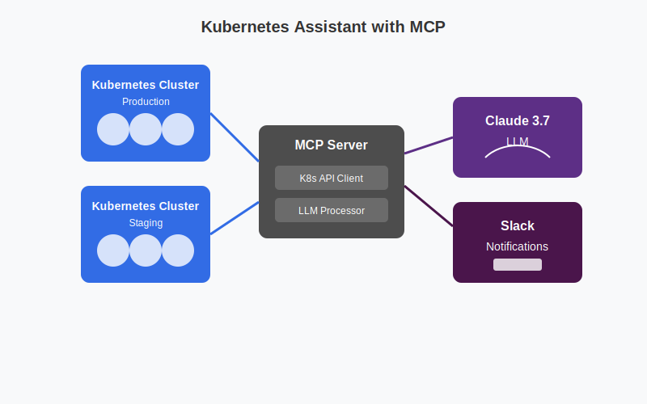

# Kubernetes Assistant



## Overview
The Kubernetes Assistant is an advanced monitoring tool that connects to your Kubernetes clusters to:

- Diagnose pod and service issues through log and event analysis
- Recommend optimal resource configurations based on usage patterns
- Provide intelligent alerts via Slack with actionable recommendations
- Detect inefficient or insecure configurations

## Features
- **Multi-cluster monitoring**: Connect to and monitor multiple Kubernetes clusters simultaneously
- **Intelligent analysis**: Uses Claude 3.7 Sonnet LLM to analyze issues and provide human-readable diagnoses
- **Actionable recommendations**: Provides specific recommendations to resolve detected issues
- **Slack integration**: Sends formatted alerts with relevant context to Slack channels

## Project Structure
```
kubernetes-monitor/
├── config/             # Configuration management
├── k8s/                # Kubernetes monitoring logic
├── llm/                # LLM processing for analysis
├── notifications/      # Notification services (Slack)
├── utils/              # Utility functions
├── main.py             # Main application entry point
├── requirements.txt    # Project dependencies
└── README.md           # This file
```

## Setup

### Prerequisites
- Python 3.12+
- Access to Kubernetes clusters
- Slack workspace with bot permissions
- Anthropic API key for Claude

### Environment Variables
Create a `.env` file with the following variables:
```
export ANTHROPIC_API_KEY="your-api-key"
export SLACK_API_TOKEN="your-slack-token"
```

### Installation
1. Clone the repository
2. Install dependencies:
   ```
   pip install -r requirements.txt
   ```
3. Configure your Kubernetes contexts
4. Set up environment variables
5. Run the application:
   ```
   source .env
   python main.py
   ```

## Development Commands
- **Run application**: `python main.py`
- **Install dependencies**: `pip install -r requirements.txt`

## Slack Setup
1. Create a Slack app in your workspace
2. Add the following Bot Token Scopes:
   - `chat:write`
   - `chat:write.public`
   - `channels:read`
3. Install the app to your workspace
4. Invite the bot to the channels where you want to receive alerts
